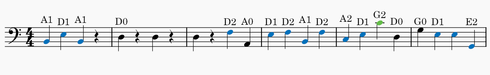

# 🎻 double-bass-fingering

> A MuseScore plugin that automatically adds **Simandl fingerings** to double bass scores using a context-aware dynamic programming algorithm.


---

 

## ✨ What it does

- Reads every note in the score (or selection)
- Calculates **all valid fingering options** across all 4 strings using the Simandl position system
- Finds the **optimal sequence** for the whole phrase using dynamic programming — preferring lower positions and minimizing position shifts
- Adds **string + finger labels** above each note (e.g. `A2`, `D4`, `E0`)
- **Colors each note** by position so you can see position changes at a glance

---

## 🎨 Color legend

| Color | Position |
|-------|----------|
| ⚫ Black | Open string |
| 🩵 Cyan | Half position |
| 🔵 Blue | 1st position |
| 🟢 Green | 2nd position |
| 🟡 Yellow | 3rd position |
| 🟠 Orange | 4th position |
| 🔴 Red | 5th position |
| 🟣 Purple | 6th position |

---

## 📋 Requirements

- **MuseScore 4.x** (tested on 4.6.5)
- Also compatible with MuseScore 3.x

---

## 📥 Installation

1. Download `DoubleBassSimandl.qml`
2. Copy it to your MuseScore plugins folder:

| OS | Path |
|----|------|
| Windows | `Documents\MuseScore4\Plugins\` |
| macOS | `~/Documents/MuseScore4/Plugins/` |
| Linux | `~/Documents/MuseScore4/Plugins/` |

3. **Restart MuseScore** — plugins are scanned at startup, a restart is required
4. Go to `Plugins > Plugin Manager` and enable **Double Bass Simandl**

---

## 🎼 Usage

1. Open any score with a double bass part
2. **Entire score:** make sure nothing is selected
3. **Specific passage:** select the notes first
4. Go to `Plugins > Fingering > DoubleBassSimandl`

---

## 🛠 Customization

### Change colors

Edit the `posColors` block near the top of the `.qml` file:
```javascript
property var posColors: ({
    "Ab": "#000000",  // Open string
    "1ª": "#0071bb",  // 1st position — blue
    "½":  "#00bcd4",  // Half position — cyan
    "2ª": "#62bc47",  // 2nd position — green
    "3ª": "#f5d000",  // 3rd position — yellow
    "4ª": "#f99d1c",  // 4th position — orange
    "5ª": "#e21c48",  // 5th position — red
    "6ª": "#8d5ba6"   // 6th position — purple
})
```

### Disable coloring entirely

In `onRun`, find the section marked `// COLOR BLOCK START` and `// COLOR BLOCK END` and comment it out.

---

## ⚙️ How the algorithm works

For each note, the plugin calculates every valid fingering option across all 4 strings according to the Simandl position system (Italian fingering: fingers 1, 2, 4).

It then runs **dynamic programming** over the entire voice to find the sequence of fingerings with minimum total cost. The cost function penalizes:

- **Higher positions** — lower positions are always preferred
- **Position shifts** — staying in position is cheaper than moving
- **Large jumps** — jumping 3+ positions is heavily penalized

This means the algorithm naturally prefers 1st position over half position, avoids unnecessary string crossings, and only moves to a higher position when it genuinely reduces overall movement.

---

## ⚠️ Limitations

- Does not yet handle **thumb position** (above 6th position)
- Fingering is based on the **highest note** in each chord
- Results are a strong suggestion — not a substitute for a teacher's eye

---

## 📄 License

[GPL-3.0](LICENSE) — same license as MuseScore itself.
